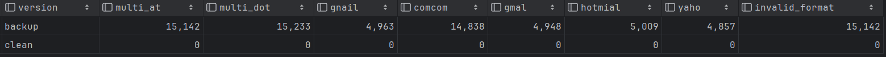

# Detailed Documentation: Customer Data Cleaning and Standardization

## Objective

Ensure data quality, consistency, and validity across the `customers` table by systematically diagnosing and correcting 
incomplete, malformed, or inconsistently formatted records.
This includes assessing missing data patterns, validating email formats, correcting nationality and name capitalization, 
and restoring accurate data-quality flags.

## Methodology and Notes

- **Backup and Restoration Procedure**  
Before any cleaning or modification, a complete backup of key identifying columns is created to preserve original data
integrity. This allows restoration of “noisy” fields in case of rollback or verification needs. 
([SQL Script]((01)_create_customers_table_backup.sql))

- **Data Quality Classification**  
A new column `data_quality` is added to the `customers` table to categorize records based on the completeness of key 
personal information (`email`, `date_of_birth`, `phone`). Categories include combinations of missing attributes 
(e.g., `email_dob_missing`, `email_phone_missing`) and a final `complete` category for fully valid records.
This classification provides a quick diagnostic overview of missing data patterns.

- **Email Diagnosis and Correction**  
Common formatting issues and typographical errors in email addresses are detected using PostgreSQL regular expressions
(`~*`). The analysis includes invalid constructs such as multiple “@” or “.” characters, duplicated suffixes 
(`.comcom`), and frequent domain misspellings (`@gnail.com`, `@hotmial.com`,` @yaho`).These are summarized in 
diagnostic counts against both the **original noisy dataset** (`customers_noisy_backup`) and the cleaned dataset.

  - Typos are corrected using a sequence of `UPDATE` statements with `REGEXP_REPLACE()`.
  - Invalid formats that remain after cleaning are set to `NULL`.
  - Validation is verified by comparing pre- and post-cleaning results using a `UNION ALL` check that counts residual 
    format errors by type.

- **Reapplying Data Quality Labels**  
Following email cleaning, the `data_quality` column is recomputed to ensure all records reflect updated completeness 
status.

- **Nationality Validation and Formatting**  
Nationality entries are validated against a defined whitelist of 18 valid country names representing the simulation’s 
supported markets.

  - Any entry not matching this list in the backup table is flagged during diagnostics.
  - The cleaning step applies `INITCAP(nationality)` to enforce title case consistency (e.g., “germany” → “Germany”).
  - Verification queries confirm zero invalid or misspelled entries post-cleaning.

- **Full Name Diagnosis and Advanced Standardization**  
Full names were examined for inconsistent casing and linguistic prefixes (e.g., de, van, von, mc, o’) using regex 
diagnostics against the backup table. A custom `SMART_INITCAP()` – developed with assistance from ChatGPT – was 
implemented to handle these cases more accurately than PostgreSQL’s native INITCAP(). This function preserves
lowercase particles (e.g., de, la, von) and known exceptions (e.g., McDonald, McCarthy). After applying 
`UPDATE customers SET full_name = SMART_INITCAP(full_name);`, based on a verification step, the names appear to 
follow proper capitalization and linguistic conventions.

- **Verification Protocol**  
Each transformation stage (email, nationality, full name) is followed by a control query comparing the cleaned 
dataset against the noisy backup. This step ensures all anomalies have been eliminated and that the data now conforms 
to consistent quality standards.

## Key Insights

- **High Overall Data Completeness**  
97.0% of customer records are fully complete, with less than 3% containing any missing combination of `email`, 
`date_of_birth`, or `phone`. The most common gaps are individual field omissions – primarily missing `date_of_birth`, 
`email`, and `phone` (frequency for each roughly 0.98%).

- **Email Cleaning Fully Effective**  
Before cleaning, roughly 65K records showed major email anomaly (multiple “@” or multiple “.”, domain typos 
like `gnail`, `hotmial`, `yaho`, or malformed `.comcom`). After correction, all residual email format issues were 
reduced to zero, confirming full normalization and validation success. 

- **Nationality Values**  
Before cleaning, roughly 131K records were not correctly capitalized. Post-cleaning checks confirm all nationality 
values align with the predefined whitelist.

- **Name Cleaning with Smart Title Case Function**  
Names now follow linguistically correct capitalization, including complex surname structures 
(e.g., de, la, von, Mc, O’). This extends beyond simple `INITCAP()` normalization and improves readability and 
authenticity.
