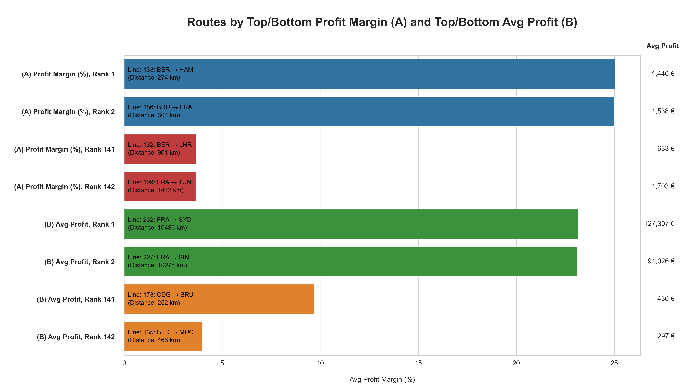

# Detailed Documentation: Revenue and Profit Analysis

## Objective

This analysis investigates how various financial performance metrics – particularly profits and profit margins – 
vary across:

- Flight distance categories
- Days of the week and travel seasons
- Passenger classes
- Individual routes

It also examines how revenues are affected by:

- Flight cancellations
- Granted frequent flyer discounts

## Methodology and Notes

- **Booked Rates** (bookings / capacity * 100) are included in most financial queries as a predictor of profitability.
Unlike in the [capacity demand and utilization analysis](../(B)_capacity_demand_and_utilization/CAPACITY_DEMAND_AND_UTILIZATION.md), 
booked rates here exclude canceled flights since they generate no revenue or profit.
- **Revenues** are calculated by summing ticket prices paid per grouping (flight, time period, passenger class, etc.). 
Canceled flights are excluded because all payments are refunded in full.
- **Costs** are stored at the per-flight level by default but can be adjusted to the per-flight-and-passenger-class 
level using class-specific cost-share multipliers.
- **Profit Margins** are expressed as percentages (profit / revenue * 100).
- **Performance Tiers**  
Flight routes are classified by their average profit margin as follows:
  
  | Tier | Label            | Profit Margin Range |
  |------|------------------|---------------------|
  | A    | Top Profits      | ≥ 25%               |
  | B    | High Profits     | 20–24%              |
  | C    | Healthy Profits  | 15–19%              |
  | D    | Marginal Profits | 5–14%               |
  | E    | Loss Risk        | < 5%                |

## Key Insights

- **By Flight Distance**

  - Long-haul flights show the highest average profit margin (16.4%) and by far the highest average profit per flight 
    (~44k €).
  - Short-haul flights yield the lowest average profit (~2k €).
  - Medium-haul flights have the lowest profit margins (13.1%) despite slightly higher booked rates (78.5% vs. 75.5% 
    for short-haul).

- **By Passenger Class**

  - First class delivers the highest average profit margin (37.3%) and the highest profit per flight (~19.7k €).
  - Economy class shows the lowest profit per flight (~2.8k €) and margin (8.4%).
  - Across all classes, higher booked rates correlate strongly with both higher profit margins and profits per flight.

- **By Time and Season**  
Patterns in financial performance mirror those observed in capacity utilization:

  - Best-performing weekdays: Friday and Sunday
  - Lowest-performing weekdays: Tuesday and Saturday
  - Best seasons: Summer and December (holiday peak)
  - Weakest seasons: January/February and autumn  

  These align with expected passenger travel behavior.

- **By Route (Profit Margin Distribution)**

  - ~40% of routes achieve profit margins ≥ 20% (tiers A–B).
  - ~57% fall within the marginal profit range (5–14%), averaging around 10%.
  - Only ~2.8% of routes (four in total) operate at loss risk (< 5% average margin).

- **By Individual Flight (Independent of Route)**

  - 19.5% of flights operate at a loss (average margin ≈ –8.5%).
  - 11.8% yield high profits (30–39%).
  - The majority fall within healthy (15–29%) or marginal (5–14%) profit ranges.

- **Top and Bottom Routes**

  - Routes with the highest total profits are exclusively long-haul.
  - Routes with the highest profit margins (%) are exclusively short-haul.
  - The lowest performers for both metrics are entirely short-haul routes.

  

    - [German: Stärkste/Schwächste Routen](../visualizations/german/(07)_tf_routen_profit.png)

## Interpretive Note

The strong financial performance of long-haul flights/routes and first-class seats indicates effective, risk-aware 
scheduling. Because these segments carry the highest operating costs, underutilization would have a disproportionately 
negative impact on profitability. Their high booked and occupancy rates suggest that capacity is carefully aligned with 
actual demand – possibly even indicating slight underestimation of demand potential in premium segments.
