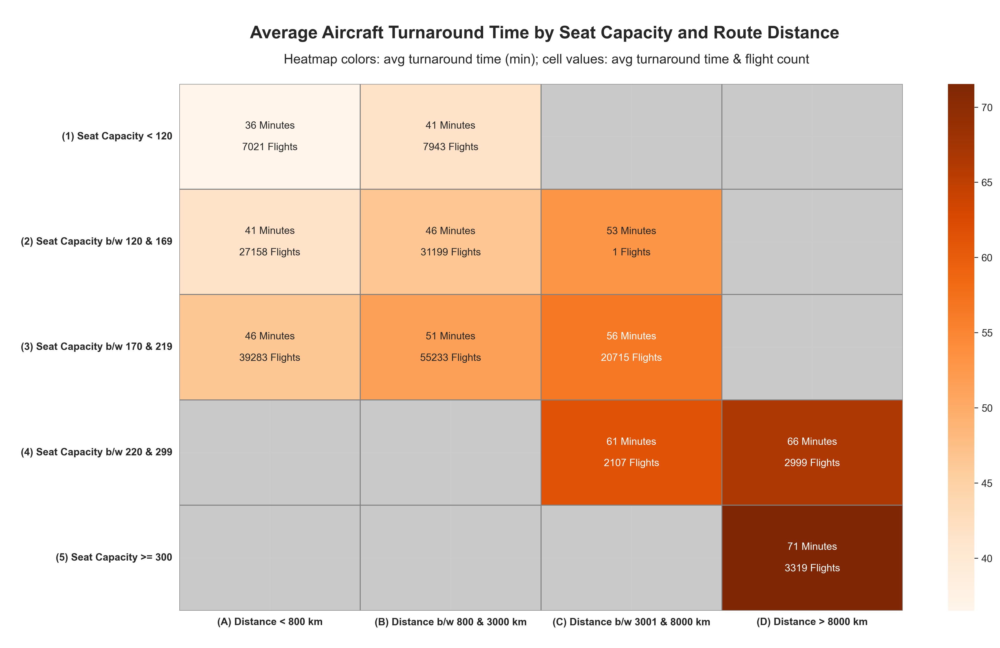

# Detailed Documentation: Operational Performance Analysis

## Objective

This analysis evaluates key operational performance metrics across the airline’s network, focusing on:

- On-time performance and delay causes
- Flight cancellation frequency and reasons
- Aircraft utilization patterns
- Turnaround times
- Cabin configuration assignments

## Methodology and Notes

- **On-Time and Delay Metrics**  
Separate CTE chains calculate departure and arrival delay metrics, which are concatenated using `UNION ALL`.
Combined (overall) values are computed as weighted averages normalized by flight count.  
Although this is redundant for the simulated dataset (which ensures equal numbers of departures and arrivals per day),  
it reflects best practice for real-world data handling.

- **Delay Severity Categories**  
Routes are assigned to categories based on their _average delay minutes_:
  
  | Category          | Average Delay (minutes) |
  |-------------------|-------------------------|
  | On-time           | < 5                     |
  | Slight delay      | 5–14                    |
  | Moderate delay    | 15–29                   |
  | Substantial delay | 30–59                   |
  | Severe delay      | ≥ 60                    |

  Category sizes are determined using conditional counts:
  `COUNT(...) FILTER (WHERE delay_minutes < ...)`.

- **Route–Aircraft Correlations**  
Delay metrics are analyzed together with each route’s most frequently used aircraft model to 
explore correlations between aircraft type and punctuality.
The most-used model per route is determined with:
    ````
    ROW_NUMBER() OVER (PARTITION BY line_number ORDER BY COUNT(flight_number) DESC) AS rn
    ````
  and merged via:
    ````
    LEFT JOIN (SELECT line_number, model FROM most_used_aircraft_models WHERE rn = 1)
    ````
- **Top and Bottom Route Selection**  
The three most punctual and three most delayed routes are identified separately for departures, arrivals, and combined 
metrics using `ROW_NUMBER()` ranking logic.

- **Turnaround Time Calculation**  
Turnaround times are derived by self-joining the `flights` table to pair consecutive flights per aircraft.
(See detailed explanation in the [SQL script]((05)_aircraft_turnaround_times.sql).)
Results are grouped by aircraft size (five seat-capacity ranges) and distance (four range categories).

- **Aircraft Model Comparison**  
Aircraft are compared across combined financial, operational, and reliability metrics, including:

  - Median profit margins and booked rates
  - Average daily flight counts
  - Range vs. average flight distance
  - Frequency of technical issues and failures

- **Cabin Configurations**  
Possible configurations include:

  1. Economy class only
  2. Economy + Business class
  3. Economy + Business + First class  

  Configurations are analyzed by assignment frequency, minimum and maximum flight distance, and aircraft seat capacity.

## Key Insights

- **Cancellations and Delays**

  - The majority of cancellations (61.6%) are caused by hazardous weather conditions.
  - Departure delays most commonly stem from technical issues and weather (combined share ≈ 66%).
  - Arrival delays are most often due to late departures (58%), followed by weather and airspace congestion.
  - For flights with documented delay reasons (≥ 15-minute delay), the average arrival delay is 42 minutes, 
    with a maximum of 467 minutes.

- **Most and Least Punctual Routes**

  - The most punctual routes (highest shares of < 5-minute delays) are all short-haul.
  - Their average delay times remain below 15 minutes – the threshold for recording a delay reason.
  - The routes with the largest shares of severe delays (≥ 60 minutes) belong to medium- and long-haul categories,  
    averaging 24–40 minutes with maximums up to 410 minutes.
  - The Airbus A320neo is most frequently associated with top on-time performance; the Boeing 737 MAX 9 dominates among 
    low performers.

- **Airport-Level Findings**

  - The highest departure delay rates due to air traffic control occur at:

    - O. R. Tambo International Airport (Johannesburg, South Africa)
    - Houari Boumediene Airport (Algiers, Algeria)

  - The highest arrival delay rates due to airspace congestion occur at:

    - Oslo Gardermoen Airport (Norway)
    - Tunis – Carthage International Airport (Tunisia) 
    - [See Details](delays_by_airport_output.png)

- **Aircraft Utilization**

  - **Average daily flights**

    - Short-haul: 4–5
    - Medium-haul: 2
    - Long-haul: 1

  - Long-haul models exhibit the highest median booked rates and profit margins.
  - Minor technical issues occur at similar frequencies across all models.
  - Short-haul aircraft show slightly higher rates of technical failures.

- **Turnaround Times**
Turnaround duration increases with both aircraft size and average flight distance.

  

    - [German Annotations](../visualizations/german/(08)_bodenzeit_heatmap.png)

- Cabin Configuration Patterns:

  - Economy plus Business accounts for 85% of flights.
  - The remaining 15% are split roughly evenly between Economy only and Economy + Business + First.
  - All Economy-only flights use the Bombardier CRJ900 (90 seats), the smallest aircraft model in the fleet.
  - First-class cabins appear only on long-haul flights with capacities above 250 seats.
