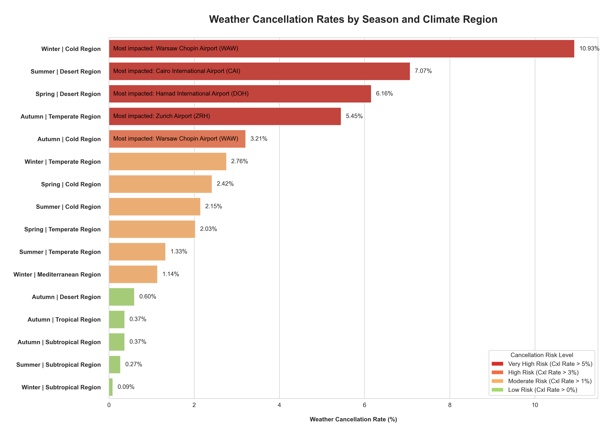

# Detailed Documentation: Weather Impact Analysis

## Objective

This analysis investigates how **hazardous weather** conditions influence **flight cancellations** and **delays**, with 
emphasis on variations by:

- Type of weather phenomenon
- Climate region and season
- Airport and flight distance category

## Methodology and Notes

- **Weather Hazard Identification**  
Two utility views derived from the `weather` table define relevant hazardous weather constellations for cancellations 
and delays. Each airport’s weather observations are flagged when conditions meet the defined thresholds. 
([Create Views](../(E)_weather_impact/create_weather_hazards_views.sql))

- **Observation Windows**  
For each flight, a distinct observation window is established based on its scheduled departure time and distance
category. Combinations of severe conditions – such as fog, blizzards, sandstorms, extreme winds, or extreme 
temperatures – occurring within these windows are counted, converted to percentage shares, and ranked.
  - [Weather Cancellation Reasons](cancellations/(a)_wcxl_individual_grouping_variables/(01)_weather_cxl_reasons.sql)
  - [Weather Delay Reasons](delays/(01)_weather_delay_reasons.sql)

- **Delay Metrics**  
Departure and arrival delays are analyzed through separate CTE chains and then combined as weighted averages 
(normalized by delay count).
The `GREATEST()` function is applied to determine the overall maximum delay minutes for each group.

- **Cancellation Risk Profiles**  
Routes and route groups are categorized by their weather-related cancellation rates:
  
  | Risk Category  | Cancellation Rate |
  |----------------|-------------------|
  | Very High Risk | \> 5%             |
  | High Risk      | \> 3%             |
  | Moderate Risk  | \> 1%             |
  | Low Risk       | \> 0%             |

- **Most-Impacted Airports**  
Analyses of weather-related cancellations by season and distance category or climate region identify the most affected 
airport per group. This is achieved via an additional CTE chain that:

  - Groups by airport code and name (in addition to season and distance category or climate region)
  - Ranks airports by cancellation rate using `ROW_NUMBER()`
  - Merges the top-ranking airport for each group in the final `SELECT`
  - [Cancellations by Distance Category and Season](cancellations/(b)_wcxl_combined_grouping_variables/(01)_wcxl_distance_seasons.sql)
  - [Cancellations by Climate Region and Season](cancellations/(b)_wcxl_combined_grouping_variables/(02)_wcxl_climate_seasons_airports.sql)

## Key Insights

- **Dominant Weather Causes**  

  - Fog is by far the leading cause of cancellations and delays for short-haul flights, affecting both departures and 
    arrivals.
  - It is also the primary factor for long-haul cancellations and delays and for medium-haul delays.
  - For medium-haul cancellations, high wind speeds and sandstorm-related visibility issues account for the largest 
    shares.

- **Regional and Seasonal Impacts**  

  - Cold climate regions show the highest cancellation rate due to weather (4.7%), with Oslo Gardermoen Airport being 
    most impacted (6%).
  - Desert regions experience the highest weather-related delay rate (35.4%), led by Dubai International Airport (38%).
  - The most weather-affected seasons are autumn and winter for both cancellations and delays.

- **By Distance Category**  

  - **Short-haul flights**: ~4% cancellation rate due to weather.
  - **Medium- and long-haul flights**: <1% weather-related cancellations.
  - **Delays (opposite trend)**: Long-haul flights show the highest weather delay rate (23.7%), short-haul the lowest 
    (8.1%).
  - **Average delay durations**

    - Short-haul: 63 minutes
    - Medium-haul: 76 minutes
    - Long-haul: 79 minutes

- **Season–Distance Combinations**  
When grouped jointly by season and distance category, short-haul flights in autumn exceed a 5% weather cancellation risk threshold.

- **Season–Region Combinations**  
When grouped by season and climate region, several combinations exceed a 5% weather cancellation rate (up to 10.9%):

  - Cold regions during winter
  - Desert regions during summer and spring
  - Temperate regions during autumn

  
    
  - [German annotations](../visualizations/german/(09)_wcxl_klima_jahreszeit_flughafen.png)
