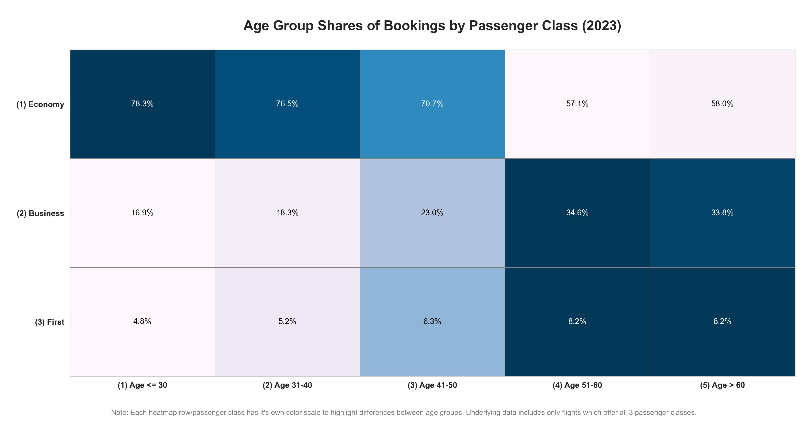
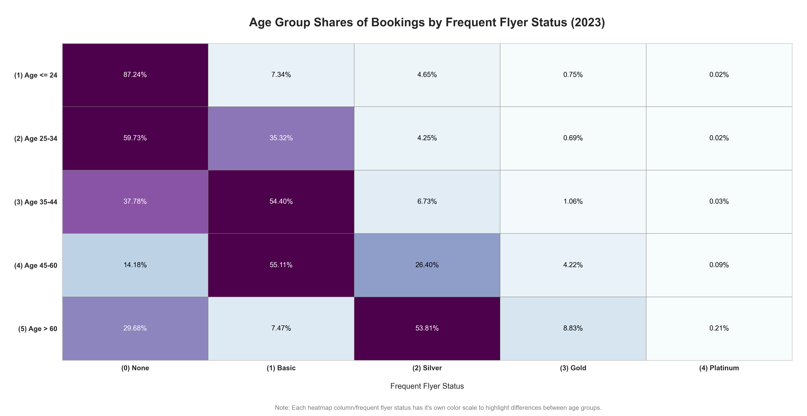

# Detailed Documentation: Customer Behavior

## Goal

Analyze the composition of the customer base with respect to age, gender, and nationality, and investigate how these 
demographic attributes correlate with:

- Passenger class preferences
- Frequent flyer status levels
- Check-in behavior
- Booking window categories
- Preferred booking times of day

## Procedural Notes

- **Age Group Assignment**  
Age groups are derived from canonical ages, calculated based on each customer’s most recent recorded flight.
This prevents customers from being counted in multiple age groups due to multiple flight records.

- **Passenger Class Preferences**  
Queries analyzing class preferences use the `cabin_configuration` column from the view
`flights_booked_passengers` (generated [here](../(i)_create_utility_views_and_tables.sql)).
“Economy only” flights are excluded, as they do not represent a meaningful choice between passenger classes.

- **Class and Frequent Flyer Status Correlations**  
Queries investigating relationships between passenger class and frequent flyer status compute a variety of
percentage-share metrics, including:

  - share of total bookings for each combination of age group and frequent flyer status
  - share of unique customers within each frequent flyer status that belong to a given age group
  - share of unique customers within each age group that belong to a given frequent flyer status

  (Column interpretation guides are included in the comment sections of the relevant SQL scripts.)

- **Booking Lead Times**  
Lead times (days between booking and flight dates) are aggregated by age group and gender into
percentage-share columns across defined window categories – from “less than four weeks” to “more than twelve weeks.”  
([Details]((04)_customer_booking_windows.sql))

- **Booking Times of Day**  
Booking distributions by nationality are measured across daily UTC windows
(e.g., `pct_bkgs_6_to_12_utc`, `pct_bkgs_12_to_17_utc`, etc.), providing insight into temporal booking preferences.
([Details]((05)_nationality_booking_times.sql))

## Key Insights

- **Demographics Overview**  
  - 47.9% of customers are women, 52.1% are men.  
  - Age group composition:  

    - ≤ 24 years – 21%
    - 25–34 years – 38%
    - 35–44 years – 25%
    - 45–60 years – 10%
    - \> 60 years – 5%
  
  - The most represented nationalities (in descending order) are German, French, British, and Austrian.

- **Passenger Class Preferences**  
Men book business and first-class seats at a slightly higher rate than women.
Older customers show a markedly stronger tendency to book premium classes compared to younger ones.  

  

  - [German Annotations](../visualizations/german/(10)_alter_klassen_heatmap.png)

- **Frequent Flyer Status Distribution**  
Men are somewhat more represented among higher frequent flyer tiers.
Similarly, older customers appear disproportionately in upper-tier frequent flyer categories.  

  

  - [German Annotations](../visualizations/german/(11)_alter_vielflieger_heatmap.png)

- **Check-In Behavior**  
Customers under 25 have the highest rate of missed check-ins (9.5%).
The rate decreases with age before rising slightly again for those over 60.
Across all age groups, women are less likely to miss check-ins than men.

- **Booking Lead Times**  
Average booking lead time increases steadily with age – from **42 days** for customers under 25
to **108 days** for customers over 60. Women generally book earlier than men.

- **Booking Times by Nationality**  
  - The **Scandinavian countries** show the highest share of bookings between **06:00–12:00 UTC**.
  - **Switzerland** and **Poland** dominate in the **12:00–17:00 UTC** window.
  - **Brazil** and **Spain** lead in the **17:00–22:00 UTC** window.
  - **Australia** shows the highest share of bookings during **22:00–06:00 UTC**.
  - When looking at local times, **Canadians** exhibit the strongest preference for booking early in the day,
    while Spaniards most frequently book in the evening.
