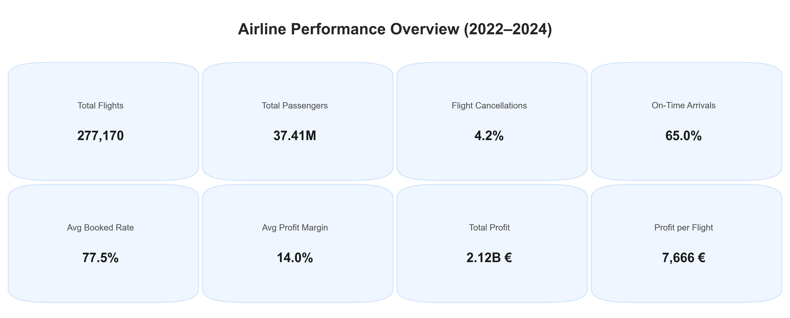

# Airline Data Analysis (SQL)

## Introduction

This project performs an end-to-end analysis of a simulated airline database using **PostgreSQL**.
It investigates the operational, financial, environmental, and behavioral dynamics of a commercial airline through 
a structured series of SQL-based analytical modules, complemented by **Python-based visualizations**.

The overarching goal is to demonstrate advanced SQL proficiency, data modelling, and insight generation in a realistic 
aviation context. Each analytical area has been documented in detail, covering:

- [Customer Data Cleaning and Standardization]((A)_cleaning_customers_table/CLEANING_CUSTOMERS.md)
- [Capacity Demand and Utilization]((B)_capacity_demand_and_utilization/CAPACITY_DEMAND_AND_UTILIZATION.md)
- [Revenue and Profit]((C)_revenue_and_profit/REVENUE_AND_PROFIT.md)
- [Operational Performance]((D)_operational_performance/OPERATIONAL_PERFORMANCE.md)
- [Weather Impact]((E)_weather_impact/WEATHER_IMPACT.md)
- [Customer Behavior]((F)_customers/CUSTOMERS.md)
- [Visualization Module](visualizations/VISUALIZATIONS.md)

## Problem Statement

Airlines operate complex networks of flights, routes, and passenger interactions – each influenced by a variety of 
operational and environmental factors. This project aims to simulate such complexity and provide data-driven answers 
to questions such as:

- How efficiently are aircraft capacities utilized?
- Which routes, passenger classes, and flight distances yield the highest profits?
- How do operational factors such as delays, cancellations, and turnaround times vary by aircraft type and route?
- What impact do hazardous weather conditions have on delays and cancellations?
- How do customer demographics (age, gender, nationality) influence booking patterns, class choices, and loyalty status?

## Skills Demonstrated

- **Advanced SQL (PostgreSQL)**  

  - Complex joins, CTE-chains, subqueries, and window functions
  - Data aggregation with `CUBE` and `GROUPING SETS`
  - Data cleaning and pattern recognition using regular expressions (`regexp_replace`, `~*`)
  - Use of analytical constructs such as weighted averages, rank-based route comparisons, and category-based 
    performance tiers

- **Data Engineering**  
 
  - Creation of utility views, backup tables, and diagnostic scripts
  - Consistent application of quality checks, totals validation, and NULL-safe division logic

- **Team-Based SQL Development**
  - Coordinating query design
  - Validating each other’s logic
  - Maintaining consistent conventions across analytical scripts, utility views, and diagnostic checks.

- **Data Visualization and Interpretation**  

  - Use of **Matplotlib** and **Seaborn** in Python for comparative visual analysis
  - Dual-language (English/German) labeling and annotation

- **Analytical Reasoning**  

  - Interpretation of simulated performance indicators (load-factor, profits, delays, cancellations)
  - Development of interpretable metrics and tier classifications

## Data Sourcing

All data originates from a **synthetic airline database** (documented [here](https://github.com/data-analysis-colab/database_creation_airline_python/blob/master/README.md)) generated to mimic realistic 
commercial airline operations. It includes relational tables for flights, aircraft, routes, bookings, customers, 
weather observations, and costs. Noise and missing values were intentionally introduced into the `customers` table to 
test and demonstrate data cleaning procedures.

## Modelling

- Key modelling components include:

- **Utility Views and Auxiliary Tables**  
Created to simplify recurring joins and standardize grouping variables across modules (e.g., cabin configuration).

- **Data Quality Assessment**  
`customers` table enriched with a `data_quality` flag classifying completeness and integrity of contact information.

- **Derived Dimensions** like
  - Flight distance categories
  - Delay severity levels
  - Load-factor tiers
  - Profitability tiers
  - Weather risk categories
  - Customer age groups and booking windows

  These standardized dimensions ensure consistency and comparability across all analytical areas.

## Analysis

The project is organized into dedicated analytical modules, each implemented via specialized SQL scripts:

| Module                              | Focus                                                                                                                                                                                     | Key Insights                                                                                                                                                  |
|-------------------------------------|-------------------------------------------------------------------------------------------------------------------------------------------------------------------------------------------|---------------------------------------------------------------------------------------------------------------------------------------------------------------|
| **Customer Data Cleaning**          | Correction of typographical errors and handling of missing attributes in the `customers` table. Adds a `data_quality` classification to enable quality-based filtering in later analyses. | Email quality: major anomalies fully corrected (65K issues → zero). Nationality values: capitalization and whitelist alignment fully normalized (131K fixes). |
| **Capacity Demand and Utilization** | Booked rate, occupancy/load-factor, check-in gaps                                                                                                                                         | Long-haul routes, first-class seats, summer and December, Fridays and Sundays show highest average booked rates and utilization efficiency                    |
| **Revenue and Profit**              | Financial performance, adverse effects on revenue, profitability tiers                                                                                                                    | Top performers by avg profit margin: short-haul segments; top performers by profit per flight: long-haul segments                                             |
| **Operational Performance**         | On-time rates, delays, cancellations, turnaround times                                                                                                                                    | Weather and technical issues dominate delay causes; A320neo shows highest punctuality                                                                         |
| **Weather Impact**                  | Cancellations/delays by climate region, season, distance                                                                                                                                  | Fog and strong winds are top disruption causes; cold regions show highest cancellation rates                                                                  |
| **Customer Behavior**               | Demographics, loyalty status, booking behavior                                                                                                                                            | Older customers and frequent flyers favor premium classes and book earlier                                                                                    |
| **Visualization Module**            | Conversion of SQL results into visual insights via Python (Matplotlib/Seaborn). Implements bilingual plot annotation, unified color logic, and layout templates for reproducibility.      | Provides visual outputs across modules, improving interpretability and presentation. Supports both English and German versions for communication flexibility. |

## Visualization

Analytical results are visualized using Python (Matplotlib/Seaborn).
All key plots are provided in dual-language format (English and German) for documentation and presentation purposes.
Visualizations include heatmaps, bar charts, KPI cards, and line plots illustrating patterns like:

- Capacity demand by season and weekday
- Profitability by distance and class
- Delay and cancellation distributions
- Turnaround time correlations
- Seasonal weather impact
- Age- and gender-based booking behavior

**Resources**:
- [Jupyter Notebook](visualizations/visualizations.ipynb)
- [Screenshot Folder English](visualizations/english)
- [Screenshot Folder German](visualizations/german)

**Overview/Summary Visual**:

- [German annotations](visualizations/german/(01)_airline_zusammenfassung.png)

## Conclusion

This project demonstrates a **comprehensive SQL-based analytical pipeline**, combining database engineering, diagnostic 
data cleaning, and quantitative insight generation within a realistic aviation context. It highlights how structured 
SQL workflows – supported by Python visualizations – can uncover interdependencies between capacity, profit, 
operations, weather, and customer behavior.  
Through the use of modular, well-documented SQL scripts, the project provides a replicable framework for 
multidimensional performance analysis in the airline industry.

## Repository Structure

<strong>Expand/Collapse</strong>

 

├── [(A)_cleaning_customers_table/]((A)_cleaning_customers_table)  
│   ├── (01)_create_customers_table_backup.sql  
│   ├── (02)_customers_table_cleaning.sql  
│   ├── invalid_emails_before_after.png  
│   └── [CLEANING_CUSTOMERS.md]((A)_cleaning_customers_table/CLEANING_CUSTOMERS.md)  
├── [(B)_capacity_demand_and_utilization/]((B)_capacity_demand_and_utilization)  
│   ├── [(a)_lf_individual_grouping_variables/]((B)_capacity_demand_and_utilization/(a)_lf_individual_grouping_variables)  
│   │   ├── (01)_distance_load_factor.sql  
│   │   ├── (02)_countries_load_factor.sql  
│   │   └── ...   
│   ├── [(b)_lf_combined_grouping_variables]((B)_capacity_demand_and_utilization/(b)_lf_combined_grouping_variables)  
│   │   ├── (01)_lf_route_tiers_seasons.sql  
│   │   ├── (02)_lf_routes_seasons_multi_tier.sql  
│   │   └── ...  
│   └── [CAPACITY_DEMAND_AND_UTILIZATION.md]((B)_capacity_demand_and_utilization/CAPACITY_DEMAND_AND_UTILIZATION.md)  
├── [(C)_revenue_and_profit]((C)_revenue_and_profit)  
│   ├── (01)_distance_category_profits.sql  
│   ├── (02)_weekday_profits.sql  
│   ├── ...  
│   └── [REVENUE_AND_PROFIT.md]((C)_revenue_and_profit/REVENUE_AND_PROFIT.md)  
├── [(D)_operational_performance]((D)_operational_performance)  
│   ├── (01)_delay_and_cancellation_shares.sql  
│   ├── (02)_delays_airports.sql  
│   ├── ...  
│   ├── delays_by_airport_output.png  
│   └── [OPERATIONAL_PERFORMANCE.md]((D)_operational_performance/OPERATIONAL_PERFORMANCE.md)  
├── [(E)_weather_impact/]((E)_weather_impact)  
│   ├── cancellations/  
│   │   ├── [(a)_wcxl_individual_grouping_variables/]((E)_weather_impact/cancellations/(a)_wcxl_individual_grouping_variables)  
│   │   │   ├── (01)_weather_cxl_reasons.sql  
│   │   │   ├── (02)_climate_regions_weather_cxl.sql  
│   │   │   └── ...  
│   │   ├── [(b)_wcxl_combined_grouping_variables/]((E)_weather_impact/cancellations/(b)_wcxl_combined_grouping_variables)  
│   │   │   ├── (01)_wcxl_distance_seasons.sql  
│   │   │   └── (02)_wcxl_climate_seasons_airports.sql  
│   ├── [delays/]((E)_weather_impact/delays)   
│   │   ├── (01)_weather_delay_reasons.sql  
│   │   ├── (02)_climate_regions_weather_dly.sql  
│   │   └── ...  
│   └── [WEATHER_IMPACT.md]((E)_weather_impact/WEATHER_IMPACT.md)  
├── [(F)_customers/]((F)_customers)  
│   ├── (01a)_age_group_class_bookings.sql  
│   ├── (01b)_gender_class_bookings.sql  
│   ├── ...  
│   └── [CUSTOMERS.md]((F)_customers/CUSTOMERS.md)  
├── visualizations/  
│   ├── [english/](visualizations/english)  
│   │   ├── (01)_airline_summary.png  
│   │   ├── (02a)_booked_rate_routes_seasons_heatmap.png  
│   │   └── ...  
│   ├── [german/](visualizations/german)  
│   │   ├── (01)_airline_zusammenfassung.png  
│   │   ├── (02a)_buchungsrate_routen_reisezeiten_heatmap.png  
│   │   └── ...  
│   ├── [visualizations.ipynb](visualizations/visualizations.ipynb)  
│   └── [VISUALIZATIONS.md](visualizations/VISUALIZATIONS.md)  
├── [(i)_create_utility_views_and_tables.sql]((i)_create_utility_views_and_tables.sql)  
├── [(ii)_summary_query.sql]((ii)_summary_query.sql)  
└── [README.md](README.md)

## Authors
Jan H. Schüttler (Linkedin), Behzad Nematipour ([linkedin](https://linkedin.com/in/behzad-nematipour-99b8b4399))