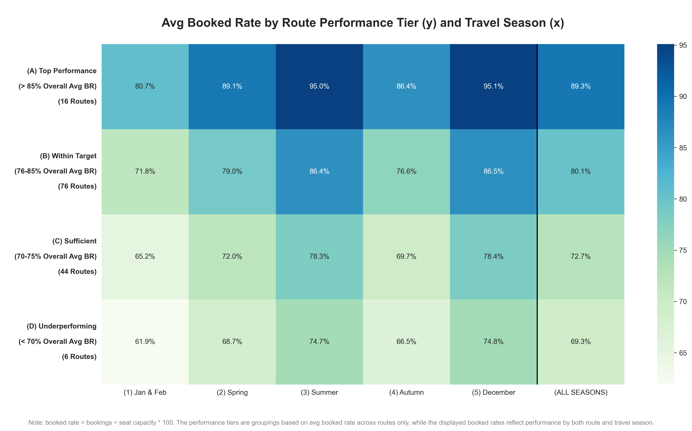
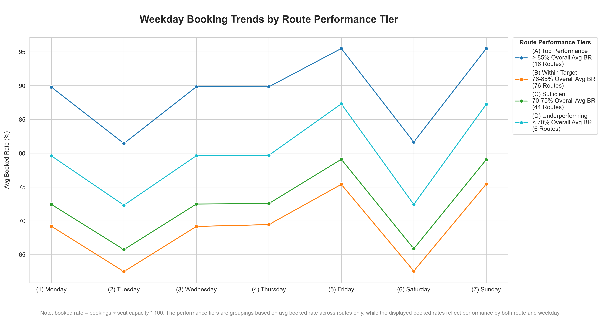

# Detailed Documentation – Visualization Module

## Purpose and Scope

This visualization module serves as the central interface for generating all analytical graphics and dashboards based 
on aggregated SQL data from the `airline_data` PostgreSQL database. It connects directly to precomputed SQL views and 
query scripts, dynamically executes them, and translates the resulting datasets into high-quality, publication-ready
figures using **Matplotlib** and **Seaborn**.

The resulting charts and heatmaps provide visual insights into route performance, demand fluctuations, profitability 
tiers, and other airline operation metrics.

## Key Functional Components

### 1. Database Connectivity

The module connects securely to a local PostgreSQL database using SQLAlchemy.
All queries are executed using either:

- `pd.read_sql_query(sql=..., con=engine)` for inline SQL strings, or
- `pd.read_sql(sql=..., con=engine)` for table/view reads.

The connection is reused across all visualization blocks, allowing efficient batch execution of analytical scripts.
All SQL scripts are executed at runtime, ensuring visualizations reflect the latest available aggregated data.

### 2. Localization and Display Formatting

A modular localization setup provides bilingual output:

- **English (default)**
- **German (optional)**

The function `set_display_locale(lang)` switches locale-dependent number and text formatting globally within the Pandas 
display environment. Depending on the selected language:

- Decimal separators (`.` vs `,`) and thousand grouping rules adapt.
- Display labels, axis titles, and footnotes are automatically translated.
- Output file paths are routed to language-specific directories (`english/` vs `german/`).

This enables consistent localization for both numeric and textual elements of each figure.

### 3. Data Acquisition from SQL Sources

Each visualization corresponds to a specific SQL query or materialized view.
Query files are organized and referenced by topic, e.g.

- **Source Period Summary/Overview** – operational, financial, and reliability-related KPIs
- **Route vs Season Metrics** – tiered route performance across seasonal travel periods
- **Top/Bottom Route Profitability** – financial performance outliers across network routes
- **Aircraft Turnaround Times** – average turnaround time by aircraft size and flight distance
- **Weather Impact** – weather-related flight cancellations by season and climate region
- **Customer Age vs Loyalty Tier** – per age group shares of bookings by frequent flyer status

The results are read into Pandas DataFrames and preprocessed for visualization (pivoting, localization, and value
formatting). Annotation customization is ChatGPT-assisted.

### 4. Visualization Framework

Plots are created using **Matplotlib** (layout, annotations, export) and **Seaborn** (heatmaps, barplots, and lineplots).
All figures follow consistent design standards:

| Design Element       | Description                                                                                                                                                                                               |
|----------------------|-----------------------------------------------------------------------------------------------------------------------------------------------------------------------------------------------------------|
| **KPI Cards**        | Compact metric panels displaying key performance indicators with locale-aware numeric formatting, featuring a rounded rectangular background, bold value, and centered label for quick visual comparison. |
| **Color Palettes**   | Sequential or diverging palettes (e.g., `GnBu`, `Blues`, `YlGnBu`) used to encode magnitude or rate-based measures.                                                                                       |
| **Annotation Style** | Numeric values, formatted per locale, displayed within heatmap cells or beside bars.                                                                                                                      |
| **Footnotes**        | Contextual explanatory notes placed beneath figures to clarify metrics or aggregation rules.                                                                                                              |
| **File Naming**      | Each figure is exported as a high-resolution `.png` file to a subfolder corresponding to its language and section.                                                                                        |
| **Font Weighting**   | Bold labels for axis categories and tier identifiers to enhance interpretability.                                                                                                                         |

The visualizations are designed for analytical clarity and presentation readiness, supporting cross-language reporting workflows.

## Output Samples

### KPI cards

- [German annotations](german/(01)_airline_zusammenfassung.png)

### Heatmap

- [German annotations](german/(02a)_buchungsrate_routen_reisezeiten_heatmap.png)

### Lineplot

- [German annotations](german/(04)_buchungsrate_routen_wochentage_lineplot.png)

### Barplot

- [German annotations](german/(07)_tf_routen_profit.png)

## Summary

The visualization module is a critical analytical layer that bridges SQL-based data aggregation with interpretive 
graphical reporting. By automating both data retrieval and bilingual visualization generation, it ensures:

- Consistent and localized analytical outputs,
- Automated synchronization between SQL queries and visual reporting, and
- Clear, structured communication of performance insights across operational, financial, and temporal dimensions.

The outputs produced by this module directly complement other analytical reports by adding visual context to 
quantitative performance trends across the airline’s network.
